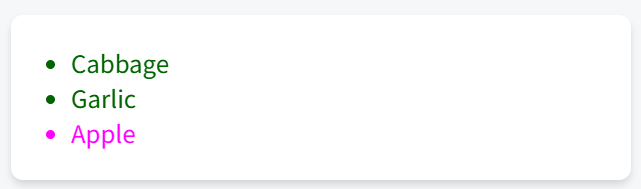

# 리스트 렌더링

### ✅리스트들을 렌더링하는 방법

컴포넌트 리스트를 렌더링하기 위해서는 for 문 및 map() 함수와 같은 자바스크립트 기능을 사용한다.

예를 들어 여러 제품이 있다고 가정해보자.

```
const products = [
  { title: 'Cabbage', id: 1 },
  { title: 'Garlic', id: 2 },
  { title: 'Apple', id: 3 },
];
```

이후 컴포넌트 내에서 map() 함수를 사용하여 제품 배열을 `<li> ` 항목 배열로 변환하면..

- 예시 코드 >

```
const listItems = products.map(product =>
  <li key={product.id}>
    {product.title}
  </li>
);

return (
  <ul>{listItems}</ul>
);
```

이 때 `<li>` 안에 key를 할당해야 한다. 이 key가 있어야 리액트가 잘 이해하니 꼭 넣어줘야 함.

### 전체적인 예시 코드 >

```
const products = [
  { title: 'Cabbage', isFruit: false, id: 1 },
  { title: 'Garlic', isFruit: false, id: 2 },
  { title: 'Apple', isFruit: true, id: 3 },
];

export default function ShoppingList() {
  const listItems = products.map(product =>
    <li
      key={product.id}
      style={{
        color: product.isFruit ? 'magenta' : 'darkgreen'
      }}
    >
      {product.title}
    </li>
  );

  return (
    <ul>{listItems}</ul>
  );
}
```


